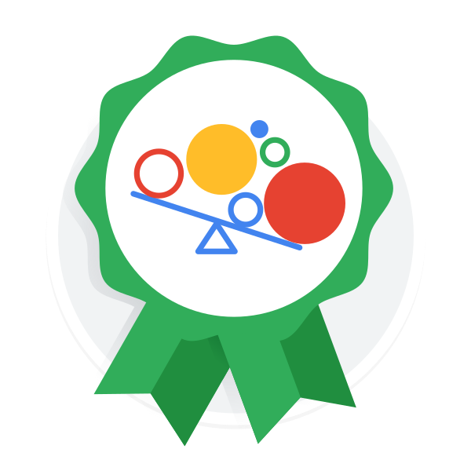

# Matias Nisperuza
**Founder & Lead Architect at Biwa Industries** *Student | 11th Grade | Machine Learning Student | Newbie Developer---Non official yet---*

### ✏️ Technical Stack

---

## 👋 About Me
I’m **Matias Nisperuza**, a developer from Colombia focused on the internal mechanics of intelligence. As the founder of **Biwa Industries**, I specialize in building proprietary system architectures and advanced model orchestration logic.

I believe technical depth is driven by curiosity, not age. If a system exists, I want to understand its core—if it doesn't, I’ll build it.

---

## 🚀 Future Vision: My Dream
My goal is to evolve into a **Fullstack Engineer and AI Developer**. I am working to bridge the gap between robust, scalable web architectures and the cutting-edge frontiers of Artificial Intelligence. I don't just want to use AI; I want to engineer the environments where it lives and thrives.

---

## 🏢 Biwa Industries (Studio Professional Projects)
* **Simula System:** A proprietary system powered by the **Cerberus Kernel**.
* **Focus:** Custom microkernel design, orchestration logic, and quantization strategies.
* **Status:** Private Professional Development.

---

## 🎓 Certifications & Qualifications

### 🤖 AI & Technical
**IBM:** Generative AI: Prompt Engineering Basics (Oct 2025) [[Certificate]](./Coursera_HYH527T4K83P.pdf)
* **Google:** Machine Learning Crash Course (Foundational Concepts)
* **SENA:** Integration of Digital Contents

### 🤝 Professional & Soft Skills
**IBM:** Developing Interpersonal Skills (Oct 2025)  [[Certificate]](./Coursera_7WCB83WLF7VM.pdf)
* **English Proficiency:** * EF SET 50-min — **C2 Proficient** [[Certificate]](./ef-set-C2.pdf)
    * EF SET 90-min — **B2 Upper-Intermediate** [[Certificate]](./ef-set-B2.pdf)

---

## ✏️ Technical Stack
**AI/ML:** PyTorch, Transformers, Prompt Engineering[cite: 25], Custom AI Architectures.
* **Languages:** Python (Advanced), HTML/CSS, JavaScript (Learning).
* **Tools:** Git, GitHub, Flask, Kernel Logic.
* **Design:** Adobe Illustrator, Blender, Krita.

---

## 🧩 Personal Projects

**[HCGK Kernels](https://github.com/mnisperuza/hcgk-kernels):** Independent kernel development projects focused on OOM failsafe and performance.

**[TinyGPT](https://github.com/mnisperuza/TinyGPT-Custom):** A lightweight GPT-style model focused on hyperparameter tuning and transformer mechanics.

---

## 📬 Connect with Me
* **Studio Email:** [biwaindustries@gmail.com](mailto:biwaindustries@gmail.com)
* **Personal Email:** [mnisperuza1102@gmail.com](mailto:mnisperuza1102@gmail.com)
* **X (Twitter):** [@MatiasNispX](https://x.com/MatiasNispX)

> Google Machine Learning Crash Course badge:

  

